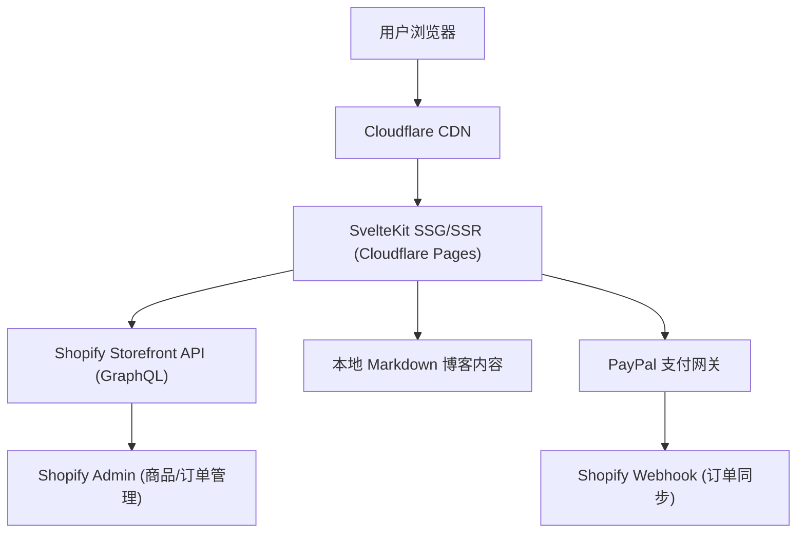
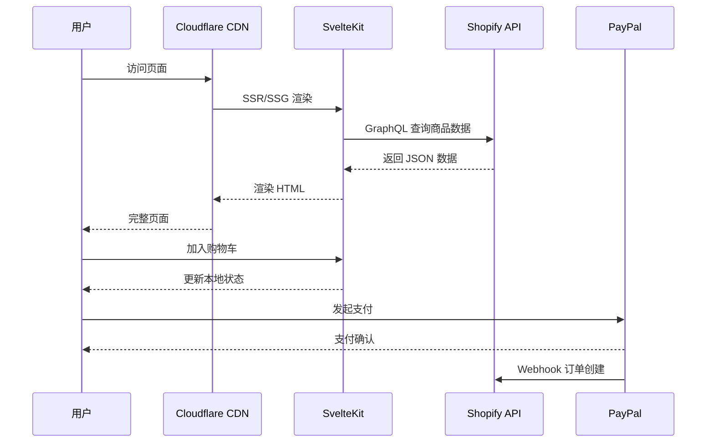

# 架构设计

## 系统概述

ShoeShop 采用 **Headless Shopify + SvelteKit 前端** 的 JAMstack 架构。Shopify 作为无头电商后端提供商品、订单、客户管理能力，SvelteKit 作为前端框架在 Cloudflare Pages 上运行，通过 Shopify Storefront API 获取数据。



## 技术栈

| 层级 | 技术 | 说明 |
|------|------|------|
| 前端框架 | SvelteKit 2.x | 服务端渲染 + 静态生成，适配器: @sveltejs/adapter-cloudflare |
| 样式 | Tailwind CSS 3.x | 原子化 CSS，@tailwindcss/typography 用于博客内容排版 |
| 数据层 | Shopify Storefront API (GraphQL) | 商品/集合/客户/结账接口 |
| 支付 | PayPal JavaScript SDK + Shopify Checkout | PayPal 快捷支付 + Shopify 完整结账 |
| 内容 | mdsvex | SvelteKit 原生 Markdown 支持，用于博客系统 |
| i18n | @sveltekit-i18n/base 或 paraglidejs | 运行时/编译时多语言方案 |
| SEO | svelte-seo / 自定义 | 结构化数据、meta标签、sitemap 自动生成 |
| 部署 | Cloudflare Pages + Workers | 全球边缘节点 + KV存储（可选缓存） |
| 构建 | Vite (SvelteKit 内置) | 开发构建 |

## 项目结构

```
shoeshop/
├── src/
│   ├── lib/
│   │   ├── shopify/          # Shopify API 封装
│   │   │   ├── client.ts     # Storefront API 客户端
│   │   │   ├── queries/      # GraphQL 查询
│   │   │   └── types.ts      # 类型定义
│   │   ├── components/       # 可复用组件
│   │   │   ├── layout/       # 布局组件 (Header, Footer)
│   │   │   ├── product/      # 产品相关组件
│   │   │   ├── cart/         # 购物车组件
│   │   │   ├── blog/         # 博客组件
│   │   │   └── ui/           # 基础 UI 组件
│   │   ├── stores/           # Svelte stores (状态管理)
│   │   ├── i18n/             # 国际化配置与翻译
│   │   └── utils/            # 工具函数
│   ├── routes/               # SvelteKit 文件路由
│   │   ├── (app)/            # 主应用布局
│   │   │   ├── [lang]/       # 多语言路由
│   │   │   │   ├── +layout.svelte
│   │   │   │   ├── +page.svelte        # 首页
│   │   │   │   ├── products/           # 产品列表
│   │   │   │   ├── products/[handle]/  # 产品详情
│   │   │   │   ├── blog/               # 博客列表
│   │   │   │   ├── blog/[slug]/        # 文章详情
│   │   │   │   ├── cart/               # 购物车
│   │   │   │   └── account/            # 用户中心
│   │   │   └── +layout.svelte
│   │   └── api/               # 服务端 API 路由
│   ├── content/               # Markdown 博客内容
│   │   └── blog/
│   │       ├── en/
│   │       ├── fr/
│   │       ├── de/
│   │       ├── it/
│   │       └── es/
│   ├── app.css                # 全局样式 + Tailwind
│   ├── app.html               # HTML 模板
│   └── hooks.server.ts        # 服务端钩子
├── static/                    # 静态资源
├── svelte.config.js
├── tailwind.config.js
├── vite.config.ts
├── wrangler.toml              # Cloudflare 配置
└── package.json
```

## 核心模块

### Shopify 数据层 (`src/lib/shopify/`)

封装 Shopify Storefront API 的 GraphQL 客户端，提供类型安全的查询接口：

- **client.ts**: 基于 `fetch` 的 GraphQL 客户端，自动注入 Storefront Access Token
- **queries/**: 预定义 GraphQL 查询（产品列表、产品详情、集合、客户登录等）
- **types.ts**: TypeScript 类型定义，与 Shopify 数据模型对应

### 产品模块 (`src/routes/(app)/[lang]/products/`)

- 产品列表页：支持分类筛选、排序、分页
- 产品详情页：图片画廊、SKU 选择、尺码表、加入购物车
- 搜索功能：基于 Shopify 搜索 API

### 国际化模块 (`src/lib/i18n/`)

- 支持 en/fr/de/it/es 五种语言
- 语言检测：URL 路径 > Cookie > 浏览器偏好
- 翻译文件分离：每个命名空间独立 JSON 文件
- SEO: hreflang 标签自动生成

### 内容营销模块 (`src/routes/(app)/[lang]/blog/`)

- 基于 mdsvex 的 Markdown 博客系统
- 文章分类：穿搭指南、鞋评、尺码指南、品牌故事
- 结构化数据：Article/BreadcrumbList schema.org 标记
- RSS/Atom Feed 自动生成

### 购物车模块 (`src/lib/stores/cart.ts`)

- Svelte writable store 管理购物车状态
- 本地持久化（localStorage）
- 与 Shopify Cart API 同步
- PayPal 快捷支付集成

### SEO 模块 (`src/lib/seo/`)

- Meta 标签管理（title, description, og, twitter）
- JSON-LD 结构化数据生成（Product, Article, BreadcrumbList, Organization）
- sitemap.xml 自动生成
- robots.txt 配置
- 性能优化：图片懒加载、CLS 控制

## 数据流



## 关键流程

### SEO 页面生成流程

1. 构建时（`npm run build`）：
   - 遍历博客文章生成静态页面
   - 从 Shopify 批量拉取产品数据生成产品静态页面
   - 生成多语言 sitemap.xml
2. 运行时（SSR）：
   - 首页/分类页实时拉取最新产品
   - 搜索页实时查询

### 结账流程

1. 用户在购物车页点击 "Checkout with PayPal"
2. 通过 Shopify Storefront API 创建 Checkout
3. 重定向到 PayPal 支付页面
4. 支付完成后 PayPal 回调 → Shopify Webhook → 订单创建
5. 用户跳转到订单确认页

## 设计决策

1. **Headless Shopify 而非纯自建后端**: Shopify 提供成熟稳定的商品/订单/库存管理，避免重复造轮子，聚焦前端体验和SEO优化
2. **SvelteKit 而非 Next.js**: 更小的打包体积（对SEO Core Web Vitals有利），更简洁的响应式语法，Cloudflare adapter 原生支持
3. **mdsvex 博客而非 CMS**: Markdown 适合技术团队内容管理，Git 版本控制，静态生成性能最优
4. **多语言路由策略**: `/[lang]/` 路径前缀方式，利于 SEO 和 hreflang 管理
5. **PayPal + Shopify Checkout 混合**: PayPal 覆盖主流支付场景，Shopify Checkout 保证完整电商体验
