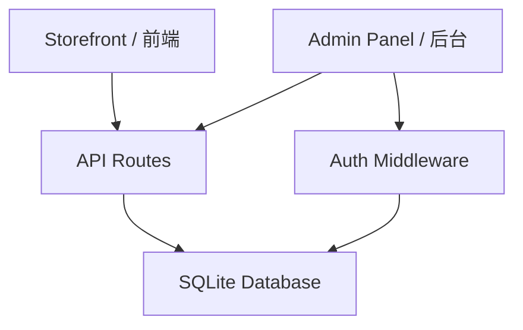

# admin-backend

Feature Name: admin-backend
Updated: 2026-07-28

## 描述

构建独立的管理后台系统，包含管理员认证、产品/订单/客户管理和店铺设置。使用 SQLite 作为数据库，API 层通过 SvelteKit 内置路由实现，管理界面作为独立路由组。

## 架构



项目内嵌在 SvelteKit 项目中，共享运行时：
- `/admin/*` — 管理后台前端路由
- `/api/admin/*` — 管理 API 接口
- `/api/store/*` — 前端消费接口（替代现有 mock）

## 组件与接口

### 路由结构

```
src/routes/
├── (app)/[lang]/           # 现有店铺前端（不变）
├── admin/                  # 管理后台路由
│   ├── login/+page.svelte
│   ├── +layout.svelte      # 认证守卫 + 后台布局
│   ├── products/
│   │   ├── +page.svelte    # 产品列表
│   │   ├── new/+page.svelte# 新建产品
│   │   └── [id]/edit/+page.svelte
│   ├── orders/
│   │   ├── +page.svelte
│   │   └── [id]/+page.svelte
│   ├── customers/
│   │   ├── +page.svelte
│   │   └── [id]/+page.svelte
│   └── settings/+page.svelte
├── api/admin/
│   ├── auth/
│   │   ├── login/+server.ts
│   │   └── logout/+server.ts
│   ├── products/
│   │   ├── +server.ts      # POST(创建) / GET(列表)
│   │   └── [id]/+server.ts # PUT / DELETE
│   ├── orders/+server.ts
│   ├── customers/+server.ts
│   └── settings/+server.ts
└── api/store/
    └── products/+server.ts  # 替代 mock 数据
```

### 核心模块

| 模块 | 路径 | 职责 |
|------|------|------|
| DB | `$lib/server/db.ts` | SQLite 连接、初始化、迁移 |
| Auth | `$lib/server/auth.ts` | Session 验证、密码哈希 |
| ProductRepo | `$lib/server/product-repo.ts` | 产品 CRUD |
| OrderRepo | `$lib/server/order-repo.ts` | 订单操作 |
| CustomerRepo | `$lib/server/customer-repo.ts` | 客户查询 |

## 数据模型

### admins
| 列 | 类型 | 说明 |
|----|------|------|
| id | INTEGER PK | 自增 |
| username | TEXT | 用户名 |
| password_hash | TEXT | bcrypt 哈希 |

### products
| 列 | 类型 | 说明 |
|----|------|------|
| id | TEXT PK | UUID |
| title | TEXT | 产品名称 |
| handle | TEXT UNIQUE | URL slug |
| description | TEXT | 纯文本描述 |
| description_html | TEXT | HTML 描述 |
| price | REAL | 当前售价 |
| compare_at_price | REAL | 原价（可选） |
| stock | INTEGER | 库存 |
| collection | TEXT | 分类(running/lifestyle/performance) |
| status | TEXT | active/archived |
| created_at | INTEGER | 时间戳 |
| updated_at | INTEGER | 时间戳 |

### product_images
| 列 | 类型 | 说明 |
|----|------|------|
| id | INTEGER PK | 自增 |
| product_id | TEXT FK | 关联 products.id |
| url | TEXT | 图片路径 |
| alt_text | TEXT | alt 描述 |
| position | INTEGER | 排序号 |

### product_sizes
| 列 | 类型 | 说明 |
|----|------|------|
| product_id | TEXT FK | 关联 products.id |
| size | TEXT | US 尺码 |

### orders
| 列 | 类型 | 说明 |
|----|------|------|
| id | TEXT PK | 订单号 |
| customer_name | TEXT | 客户名 |
| customer_email | TEXT | 邮箱 |
| address | TEXT | JSON 地址 |
| total | REAL | 订单总额 |
| status | TEXT | pending/shipped/cancelled |
| created_at | INTEGER | 时间戳 |

### order_items
| 列 | 类型 | 说明 |
|----|------|------|
| id | INTEGER PK | 自增 |
| order_id | TEXT FK | 关联 orders.id |
| product_id | TEXT FK | 关联 products.id |
| product_title | TEXT | 快照名称 |
| size | TEXT | 尺码 |
| quantity | INTEGER | 数量 |
| price | REAL | 单价 |

### customers
| 列 | 类型 | 说明 |
|----|------|------|
| id | INTEGER PK | 自增 |
| name | TEXT | 姓名 |
| email | TEXT UNIQUE | 邮箱 |
| phone | TEXT | 电话（可选） |
| created_at | INTEGER | 时间戳 |

## 正确性约束

- `products.handle` 唯一，新建时自动从 title 生成 slug
- 订单创建时从 products 快照价格，后续产品改价不影响已有订单
- 软删除产品时不物理删除，只标记为 archived
- 管理员密码使用 bcrypt 哈希存储

## 错误处理

| 场景 | 处理 |
|------|------|
| 未登录访问 | 重定向 `/admin/login` |
| Token 过期 | 清除 session，重定向登录 |
| 数据库写失败 | 返回 500，记录日志 |
| 产品不存在 | 返回 404 |
| 重复 slug | 自动追加数字后缀 |

## 测试策略

- 单元测试：数据库 Repository 层
- API 测试：Admin API 路由
- E2E：管理员登录 → 新建产品 → 前端验证展示

## 实施计划

### 阶段 1 — 数据库 + Auth + 产品 CRUD
1. 安装 better-sqlite3 / sql.js
2. 实现 DB 初始化 + 迁移
3. 实现 Auth（login/logout/session）
4. 实现产品 CRUD API
5. 管理后台产品列表 + 编辑页

### 阶段 2 — 订单 + 客户
1. 订单 API + 列表/详情页
2. 结账流程对接（下单写库）
3. 客户列表/详情页

### 阶段 3 — 店铺设置 + 前端对接
1. 设置页（meta + admin 密码）
2. 前端产品/分类页切换为读 API
3. 图片上传功能
